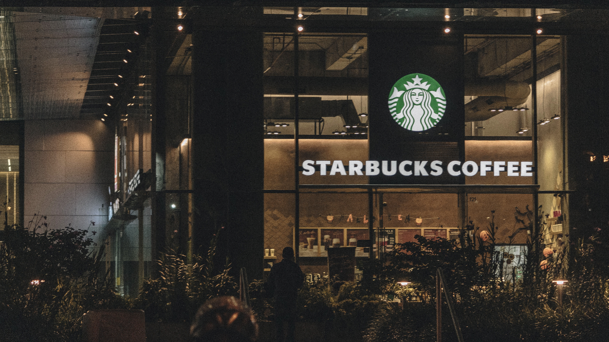

<div align="center">

    
  
  
  
  
  
 
</div>

<div style="display: inline_block">


  
# Starbucks Coffee Company
The Starbucks Coffee Company clone is a project that aims to recreate the popular coffee company's website and its functionalities. By leveraging modern web development technologies, this clone provides users with a similar experience to the official Starbucks website. Users can explore the menu, browse different coffee products, customize their orders, and add items to their cart. With attention to detail and a focus on replicating the Starbucks brand, this clone project offers coffee enthusiasts an immersive online experience reminiscent of the real Starbucks Coffee Company.
  
  ## Table of Content
  ```
  - Title and Cover Image
  - Screenshots
  - Project Description
  - Technology Used
  - Deployment
  - Feedback
  ```
